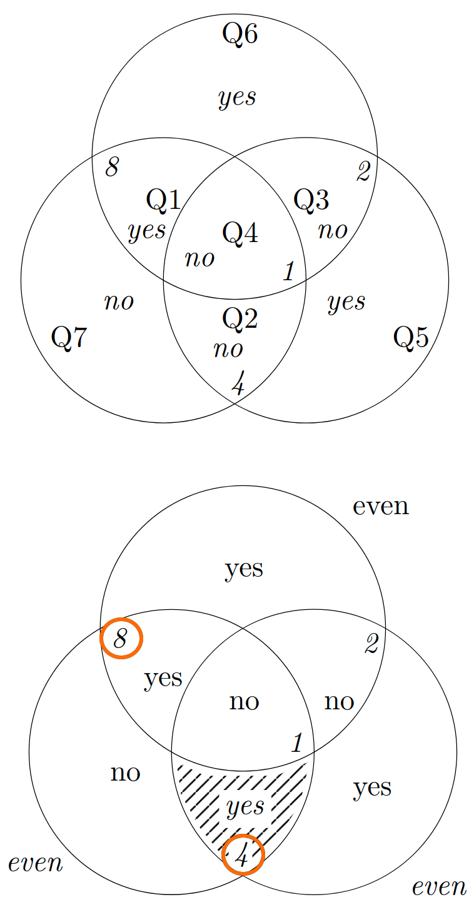

```{r setup, include=FALSE}
library(tidyverse)
library(palmerpenguins)
penguins = na.omit(penguins)
#data(package = 'palmerpenguins')
knitr::opts_chunk$set(echo = TRUE)
knitr::opts_chunk$set(fig.dim=c(4.8, 4.5), fig.retina=2, out.width="100%")
```

## Monty Hall: Changing minds with Statistics

There are 3 doors. Behind one of the doors is a prize.

A contestant is asked to choose a door.

The host then opens one of the other two doors, revealing that
the prize isn't behind it.

The contestant can then choose to stick with the door they originally picked, or switch to the other remaining door.

**What do you do?**

---

## Greedy pig: How greedy should you be?

Greedy pig is a game where players take turns rolling a single die.

- On your turn, you may roll the die as many times as you want, until you either choose to stop or roll a one.

    - If you choose to stop, your score for this turn is the sum of the numbers you rolled.
    - If you roll a one, your score for this turn is zero.

- The winner is the first player to reach a total score of 100

**Should you roll again? What strategy might you choose to decide?**

---

## Seven questions, one lie

Choose a number between $0$ and $15$ inclusive. The number must be an integer.

Answer the following seven yes-no questions. You may lie up to once if you like.

Is your number...

1. one of $8,9,10,11,12,13,14,15$?

2. one of $4,5,6,7,12,13,14,15$?

3. one of $2, 3, 6, 7, 10, 11, 14, 15$?

4. odd?

5. one of $1, 2, 4, 7, 9, 10, 12, 15$?

6. one of $1, 2, 5, 6, 8, 11, 12, 15$?

7. one of $1, 3, 4, 6, 8, 10, 13, 15$?

**I'll tell you your number, whether you lied, and if so on which question - using maths!**

---

## Monty Hall: Why you should change your mind

If you switch doors in the game you double your chances of winning! Why?

If you don't change your mind, there's a 1 in 3 chance of winning as there are 3 doors, and so the chance the prize is behind the one you picked is 1 in 3.

If you do change your mind, then the only way you lose is if the prize is behind the door you first picked (1 in 3). Thus, you must win 2 out of 3 times.

---

## Greedy Pig: Optimal score strategy

.left-code[
Suppose your score is currently $s$.

If you roll again your score increases to

roll | probability | score
-----|-------------|-------
1    | $1/6$       | $0$
2    | $1/6$       | $s+2$
3    | $1/6$       | $s+3$
4    | $1/6$       | $s+4$
5    | $1/6$       | $s+5$
6    | $1/6$       | $s+6$

]

.right-plot[
Your expected score is

$$\begin{multline*}
\frac{1}{6}\left[0 + (s+2) + (s+3)\right.\\\left.(s+4) + (s+5) + (s+6)\right] = \frac{1}{6}(5s+20)
\end{multline*}$$

You should roll if
$$\begin{align}\frac{1}{6}(5s+20) &> s\\ \Rightarrow 5s+20 &> 6s\\ \Rightarrow s &<20\end{align}$$
]

---

.left-code-wide[
## Error correcting codes: 7 questions, 1 lie

This is an example of a Hamming (7,4) code.

We can encode any number 1 to 15 using 4 true/false questions ( $2^4=16$ combinations). The first 4 questions answered truthfully reveal the number.

The last 3 questions ( $2^3=8$ combinations) encode the possibilities for the lie: No lie at all, or a lie on one of the seven questions.

These are arranged to be a *parity check* on combinations of the first four questions. There should be an even number of 'yes' answers in each circle if the truth is being told.

An odd number of 'yes' answers show which of the answers are wrong. Flipping just one answer will give even parity (e.g. Q2).

Once everything is truthful, compute the answer (e.g. $8+4=12$).
]

.right-out-narrow[
```{r, echo=FALSE, out.width='75%'}

```
]
